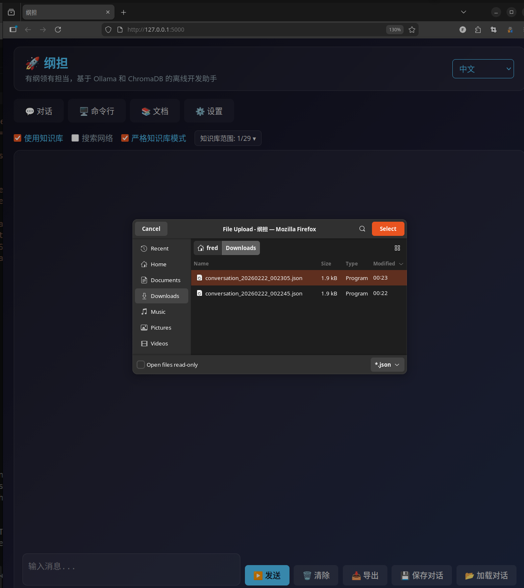
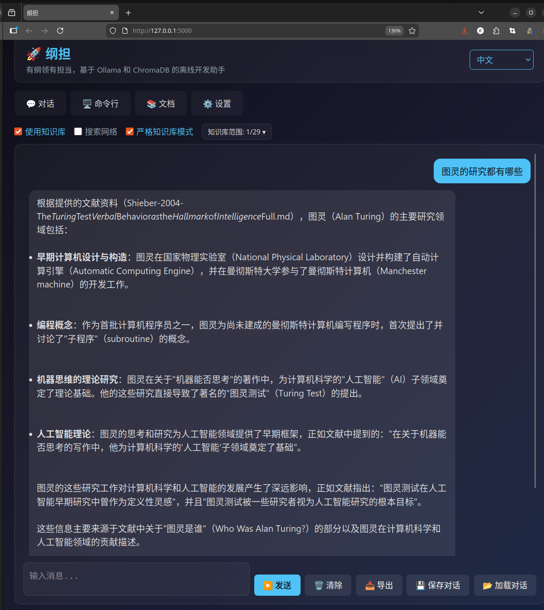

# GangDan - Offline Dev Assistant

A local-first, offline programming assistant powered by [Ollama](https://ollama.ai/) and [ChromaDB](https://www.trychroma.com/). Chat with LLMs, build a vector knowledge base from documentation, run terminal commands, and get AI-generated shell suggestions -- from a browser tab **or** the command line.

> **GangDan (纲担)** -- Principled and Accountable.


## Features

### GUI (Web Interface)

- **RAG Chat** -- Ask questions with optional retrieval from a local ChromaDB knowledge base and/or web search (DuckDuckGo, SearXNG, Brave). Responses stream in real-time via SSE. A **Knowledge Base Scope Selector** lets you pick exactly which KBs to query.
- **Strict KB Mode** -- When enabled, the system refuses to answer if no relevant content is found in the knowledge base, ensuring responses are grounded in reliable sources.
- **Citation References** -- Each response automatically includes a reference list showing the source documents, making it easy to verify and trace information.
- **Cross-Lingual Search** -- Automatically detects query and document languages, using Ollama translation for cross-lingual RAG retrieval (e.g., query English documents in Chinese).
- **AI Command Assistant** -- Describe what you want to do in natural language; the assistant generates a shell command you can drag-and-drop into the terminal, execute, and auto-summarize.
- **Built-in Terminal** -- Run commands directly in the browser with stdout/stderr display.
- **Documentation Manager** -- One-click download and indexing of 30+ popular library docs (Python, Rust, Go, JS, C/C++, CUDA, Docker, SciPy, Scikit-learn, SymPy, Jupyter, etc.). Batch operations and GitHub repo search included.
- **Custom Knowledge Base Upload** -- Upload your own Markdown (.md) and plain text (.txt) documents to create named knowledge bases. Files are automatically indexed for RAG retrieval. Duplicate file detection with skip or overwrite options.
- **Conversation Save & Load** -- Save chat conversations as JSON files and load them later to continue where you left off. The existing markdown export is also available for human-readable sharing.
- **10-Language UI** -- Switch between Chinese, English, Japanese, French, Russian, German, Italian, Spanish, Portuguese, and Korean without page reload.
- **Proxy Support** -- None / system / manual proxy modes for both the chat backend and documentation downloads.
- **Offline by Design** -- Runs entirely on your machine. No cloud APIs required.

### CLI (Command-Line Interface)

GangDan also provides a full-featured CLI that covers all GUI functionality, designed for terminal-first workflows and automation:

- **Streaming Chat** -- `gangdan chat "your question"` with real-time streaming output, KB retrieval (`--kb`), and web search (`--web`).
- **Interactive REPL** -- `gangdan cli` launches an interactive session with command history, auto-suggest, and tab completion. Use `/help` to see all available commands.
- **Knowledge Base Operations** -- `gangdan kb list` and `gangdan kb search` to browse and query your knowledge bases.
- **Documentation Management** -- `gangdan docs list`, `gangdan docs download <source>`, and `gangdan docs index <source>` to manage documentation from the terminal.
- **Configuration** -- `gangdan config get` and `gangdan config set <key> <value>` to view and modify settings.
- **Conversation Persistence** -- `gangdan conversation save/load/clear` with auto-save that persists conversations in the background.
- **Shell Command Execution** -- `gangdan run <command>` with built-in safety checks against dangerous commands.
- **AI Command Generation** -- `gangdan ai "describe what you want"` generates shell commands from natural language descriptions.
- **Rich Terminal Output** -- Beautifully formatted tables, syntax-highlighted code blocks, and Markdown rendering via the `rich` library.

## Screenshots

| Chat | Terminal |
|:----:|:--------:|
|  |  |

| Documentation | Settings |
|:-------------:|:--------:|
|  |  |

| Upload Documents | KB Scope Selection |
|:----------------:|:------------------:|
|  |  |

| Strict KB Chat with Citations |
|:-----------------------------:|
|  |

The above screenshot demonstrates Strict KB Mode in action: after selecting a specific knowledge base, the system retrieves content only from that KB and automatically appends a reference list at the end of each response, citing the source documents.

| Load Conversation | Conversation Loaded |
|:-----------------:|:-------------------:|
|  |  |

Save your chat as a JSON file and load it anytime to continue the conversation. The file picker accepts `.json` files exported by GangDan, restoring full message history and context.

## Requirements

- Python 3.10+
- [Ollama](https://ollama.ai/) running locally (default `http://localhost:11434`)
- A chat model pulled in Ollama (e.g. `ollama pull qwen2.5`)
- An embedding model for RAG (e.g. `ollama pull nomic-embed-text`)

## Installation

### Method 1: Install from PyPI (Recommended)

```bash
pip install gangdan
```

After installation, launch directly:

```bash
# Start GangDan web interface
gangdan

# Start CLI interactive mode
gangdan cli

# Or use python -m
python -m gangdan

# Custom host and port
gangdan --host 127.0.0.1 --port 8080

# Specify a custom data directory
gangdan --data-dir /path/to/my/data
```

### Method 2: Install from Source (Development)

```bash
# 1. Clone the repository
git clone https://github.com/cycleuser/GangDan.git
cd GangDan

# 2. (Optional) Create and activate a virtual environment
python -m venv .venv
source .venv/bin/activate      # Linux/macOS
# .venv\Scripts\activate       # Windows

# 3. Install in editable mode with all dependencies
pip install -e .

# 4. Launch GangDan (web or CLI)
gangdan            # Web GUI
gangdan cli        # Interactive CLI
```

### Ollama Setup

Make sure Ollama is installed and running before starting GangDan:

```bash
# Start Ollama service
ollama serve

# Pull a chat model
ollama pull qwen2.5

# Pull an embedding model for RAG
ollama pull nomic-embed-text
```

Open [http://127.0.0.1:5000](http://127.0.0.1:5000) in your browser.

## CLI Options

### Web Server Mode (default)

```
gangdan [OPTIONS]

Options:
  --host TEXT       Host to bind to (default: 0.0.0.0)
  --port INT        Port to listen on (default: 5000)
  --debug           Enable Flask debug mode
  --data-dir PATH   Custom data directory
  --version         Show version and exit
```

### CLI Mode

```bash
# Interactive REPL (recommended for terminal users)
gangdan cli

# Chat with streaming output
gangdan chat "How do I use Python decorators?"
gangdan chat "Explain numpy broadcasting" --kb numpy
gangdan chat "Latest Python news" --web

# Knowledge base operations
gangdan kb list
gangdan kb search "sorting algorithms"

# Documentation management
gangdan docs list
gangdan docs download numpy pandas pytorch
gangdan docs index numpy

# Configuration
gangdan config get
gangdan config get language
gangdan config set language en
gangdan config set chat_model qwen2.5:14b

# Conversation management
gangdan conversation save my_session.json
gangdan conversation load my_session.json
gangdan conversation clear

# Run shell commands (with safety checks)
gangdan run ls -la
gangdan run python --version

# AI command generation
gangdan ai "find all Python files larger than 1MB"
gangdan ai "compress this directory into a tar.gz"
```

### REPL Commands

Inside `gangdan cli`, the following commands are available:

| Command | Description |
|---------|-------------|
| `Hello...` | Regular chat message (just type and press Enter) |
| `/kb list` | List all knowledge bases |
| `/kb search <query>` | Search knowledge bases |
| `/docs list` | List downloaded documentation |
| `/docs download <src>` | Download documentation source |
| `/config` | Show current configuration |
| `/config set <k> <v>` | Update a configuration value |
| `/save [file]` | Save conversation to JSON |
| `/load <file>` | Load conversation from JSON |
| `/clear` | Clear conversation history |
| `/run <cmd>` | Execute a shell command |
| `/ai <desc>` | Generate command from description |
| `/help` | Show help information |
| `exit` / `quit` / `q` | Exit REPL |

## Project Structure

```
GangDan/
├── pyproject.toml              # Package metadata & build config
├── MANIFEST.in                 # Source distribution manifest
├── LICENSE                     # GPL-3.0-or-later
├── README.md                   # English documentation
├── README_CN.md                # Chinese documentation
├── gangdan/
│   ├── __init__.py             # Package version
│   ├── __main__.py             # python -m gangdan entry
│   ├── cli.py                  # Entry point routing (web vs CLI)
│   ├── cli_app.py              # CLI application (commands + REPL)
│   ├── app.py                  # Flask backend (routes, i18n, GUI logic)
│   ├── core/                   # Shared core modules
│   │   ├── __init__.py         # Core module exports
│   │   ├── config.py           # Config dataclass, i18n, language detection
│   │   ├── ollama_client.py    # Ollama API client (chat, embed, stream)
│   │   ├── chroma_manager.py   # ChromaDB manager with auto-recovery
│   │   ├── conversation.py     # Conversation manager with auto-save
│   │   ├── doc_manager.py      # Documentation downloader & indexer
│   │   └── web_searcher.py     # DuckDuckGo web search
│   ├── templates/
│   │   └── index.html          # Jinja2 HTML template
│   └── static/
│       ├── css/
│       │   └── style.css       # Application styles (dark theme)
│       └── js/
│           ├── i18n.js         # Internationalization & state management
│           ├── utils.js        # Panel switching & toast notifications
│           ├── markdown.js     # Markdown / LaTeX (KaTeX) rendering
│           ├── chat.js         # Chat panel & SSE streaming
│           ├── terminal.js     # Terminal & AI command assistant
│           ├── docs.js         # Documentation download & indexing
│           └── settings.js     # Settings panel & initialization
├── tests/                      # Comprehensive test suite
│   ├── conftest.py             # Shared fixtures & test configuration
│   ├── test_core_config.py     # Config, i18n, language detection tests
│   ├── test_core_ollama_client.py  # Ollama client tests
│   ├── test_core_chroma_manager.py # ChromaDB manager tests
│   ├── test_core_conversation.py   # Conversation & auto-save tests
│   ├── test_core_doc_manager.py    # Document manager tests
│   ├── test_core_web_searcher.py   # Web search tests
│   ├── test_cli_commands.py    # CLI command integration tests
│   └── test_cli_repl.py        # REPL & backward compatibility tests
├── images/                     # Screenshots
├── publish.py                  # PyPI publish helper script
└── test_package.py             # Package installation test
```

Runtime data (created automatically):

```
~/.gangdan/                     # Default when installed via pip
  ├── gangdan_config.json       # Persisted settings
  ├── cli_conversation.json     # CLI auto-saved conversation history
  ├── cli_history               # CLI REPL command history
  ├── user_kbs.json             # User knowledge base manifest
  ├── docs/                     # Downloaded documentation
  └── chroma/                   # ChromaDB vector store
```

## Architecture

GangDan has a modular architecture with shared core modules used by both the web GUI and CLI:

```
                    ┌──────────────┐    ┌──────────────┐
                    │   Flask GUI  │    │  CLI / REPL  │
                    │   (app.py)   │    │ (cli_app.py) │
                    └──────┬───────┘    └──────┬───────┘
                           │                   │
                    ┌──────┴───────────────────┴──────┐
                    │          gangdan/core/           │
                    ├─────────────────────────────────┤
                    │ config.py      │ ollama_client.py│
                    │ chroma_manager │ conversation.py │
                    │ doc_manager.py │ web_searcher.py │
                    └─────────────────────────────────┘
                           │                   │
                    ┌──────┴───────┐    ┌──────┴───────┐
                    │    Ollama    │    │   ChromaDB   │
                    └──────────────┘    └──────────────┘
```

- **Core Modules** (`gangdan/core/`) -- Shared business logic extracted into reusable modules: configuration management, Ollama API client, ChromaDB vector store manager, conversation persistence, document downloading/indexing, and web search.
- **GUI Backend** (`app.py`) -- Flask routes and SSE streaming. Serves the web frontend and delegates to core modules.
- **CLI Application** (`cli_app.py`) -- Full command-line interface with subcommands and an interactive REPL. Uses `rich` for terminal formatting and `prompt_toolkit` for interactive input with history and completion.
- **Frontend** (`templates/` + `static/`) -- Pure HTML/CSS/JS with no build step. JavaScript files are loaded in dependency order and share state through global functions. KaTeX is loaded from CDN for LaTeX rendering.

ChromaDB is initialized with automatic corruption recovery: if the database is damaged, it is backed up and recreated transparently.

## Configuration

All settings are managed through the **Settings** tab in the UI:

| Setting | Description |
|---------|-------------|
| Ollama URL | Ollama server address (default `http://localhost:11434`) |
| Chat Model | Model for conversation (e.g. `qwen2.5:7b-instruct`) |
| Embedding Model | Model for RAG embeddings (e.g. `nomic-embed-text`) |
| Reranker Model | Optional reranker for better search results |
| Proxy Mode | `none` / `system` / `manual` for network requests |

Settings are persisted to `gangdan_config.json` in the data directory.

## Testing

GangDan includes a comprehensive test suite with 142 tests covering all core modules and CLI functionality:

```bash
# Run full test suite
python -m pytest tests/ -v

# Run specific test module
python -m pytest tests/test_core_config.py -v
python -m pytest tests/test_cli_commands.py -v

# Run with coverage report
python -m pytest tests/ --cov=gangdan --cov-report=term-missing
```

Test coverage includes:

| Module | Tests | Coverage |
|--------|-------|----------|
| `core/config.py` | 19 | Config persistence, i18n, language detection, KB sanitization, proxy |
| `core/ollama_client.py` | 14 | Client init, availability, model classification, embedding, chat streaming |
| `core/chroma_manager.py` | 8 | Collection CRUD, document add/search, null-client safety, recovery |
| `core/conversation.py` | 12 | Message management, persistence, auto-save threads, graceful shutdown |
| `core/doc_manager.py` | 11 | Source validation, download/indexing, text chunking |
| `core/web_searcher.py` | 6 | Search, error handling, timeout, proxy integration |
| `cli_app.py` (commands) | 31 | All subcommands: config, conversation, chat, run, ai, docs, kb |
| `cli_app.py` (REPL) | 17 | Command parsing, lazy init, backward compat, entry routing |
| **Total** | **142** | |

All tests run offline with mocked external services (Ollama API, ChromaDB, HTTP). No running Ollama instance or network connection is required.

## Development

```bash
# Install dev dependencies
pip install -e ".[dev]"
pip install pytest pytest-mock pytest-cov

# Run tests
python -m pytest tests/ -v

# Quick syntax check
python -c "import gangdan.cli_app; import gangdan.core"
```

## License

GPL-3.0-or-later. See [LICENSE](LICENSE) for details.
