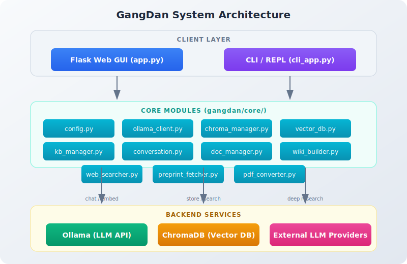
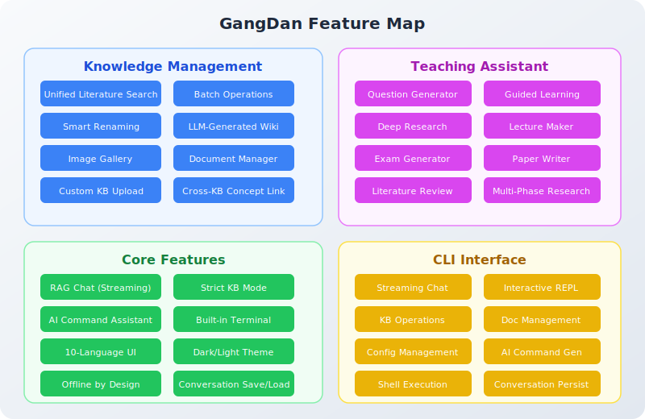
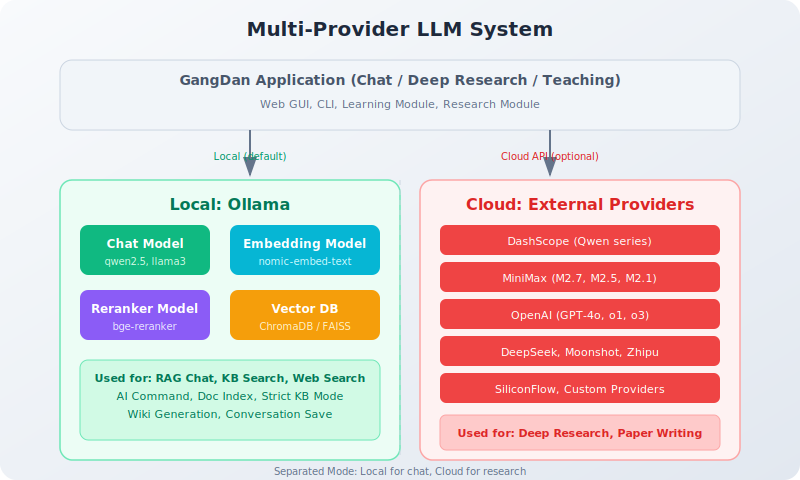
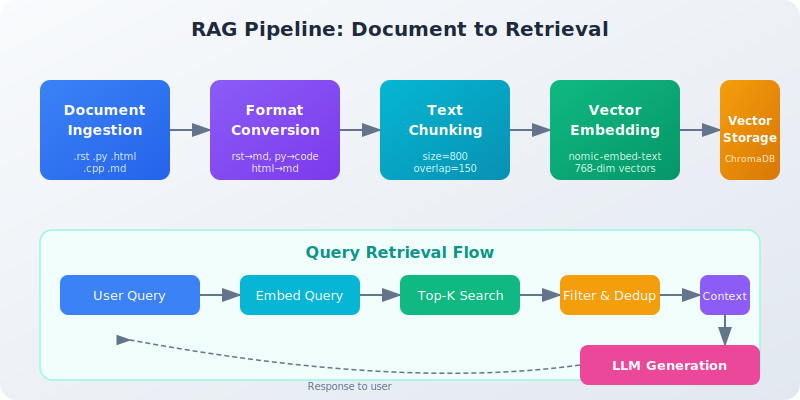
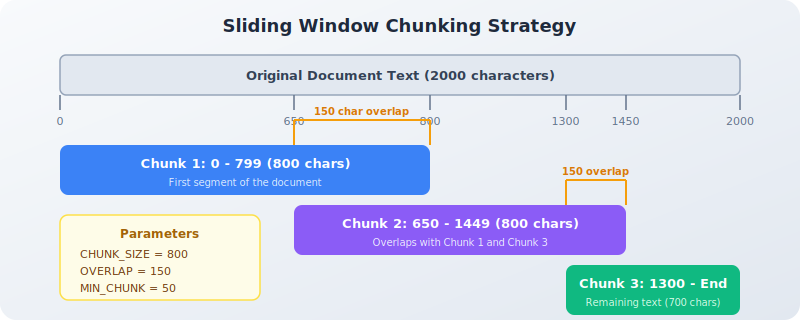

# GangDan (纲担)

LLM-powered knowledge management and teaching assistant with offline support.

> **GangDan (纲担)** — Principled and Accountable.


## Overview

GangDan is a **local-first, offline programming assistant** powered by [Ollama](https://ollama.ai/) and [ChromaDB](https://www.trychroma.com/). It combines RAG-based knowledge management with teaching assistance tools, all running entirely on your machine — no cloud APIs required.



## Features

### Knowledge Management

- **Unified Literature Search** — Search arXiv, bioRxiv, medRxiv, Semantic Scholar, CrossRef, OpenAlex, DBLP, PubMed, and GitHub in one interface. AI-powered query refinement with automatic translation and synonym expansion.
- **Batch Operations** — Multi-select, select-all, batch convert (PDF/HTML/TeX to Markdown with image and formula preservation), batch add to knowledge base. Sort by relevance, date, or title.
- **Smart Renaming** — Downloaded papers automatically renamed to citation format: `Author et al. (Year) - Title.pdf`
- **LLM-Generated Wiki** — Build structured wiki pages from knowledge base content with cross-KB concept linking. Like Wikipedia for your documents.
- **Image Gallery** — Browse and search images stored in knowledge bases with context and source attribution.
- **Document Manager** — One-click download and indexing of 30+ library docs (Python, Rust, Go, JS, CUDA, Docker, etc.). Upload custom docs, batch operations, GitHub repo search, web search to KB.
- **Custom Knowledge Base Upload** — Upload your own Markdown (.md) and plain text (.txt) documents to create named knowledge bases with automatic indexing.

### Teaching Assistant

- **Question Generator** — MCQ, short answer, fill-in-the-blank, true/false from KB content.
- **Guided Learning** — Auto-extract knowledge points, generate interactive lessons with Q&A.
- **Deep Research** — Multi-phase research pipeline: topic decomposition → RAG research → comprehensive reports.
- **Lecture Maker** — Generate structured lecture content from KB materials.
- **Exam Generator** — Create complete exam papers with answer keys from KB content.
- **Literature Review & Paper Writer** — Generate academic reviews and papers from KB content.

### Core Features

- **RAG Chat** — Streaming chat with knowledge base retrieval and web search. Strict KB mode ensures grounded answers.
- **Cross-Lingual Search** — Automatically detects query and document languages, enabling cross-lingual RAG (e.g., query English documents in Chinese).
- **Citation References** — Each response automatically includes source document references for verification.
- **AI Command Assistant** — Natural language → shell commands, draggable to terminal.
- **Built-in Terminal** — Run commands with stdout/stderr display directly in the browser.
- **Conversation Save/Load** — JSON export/import for session continuity.
- **10-Language UI** — Chinese, English, Japanese, French, Russian, German, Italian, Spanish, Portuguese, Korean.
- **Dark/Light Theme** — Full theme support with CSS variables.
- **Offline by Design** — Runs entirely on your machine. No cloud APIs required.



### Multi-Provider LLM Support

GangDan supports a **separated mode**: local Ollama for chat/embedding/reranking, with optional external LLM providers for deep research and paper writing.



| Provider | API Type | Use Case |
|----------|----------|----------|
| **Ollama** (local) | ollama | Chat, Embedding, Reranking |
| **DashScope** | OpenAI-compatible | Deep Research, Paper Writing |
| **MiniMax** | OpenAI-compatible | Deep Research |
| **Bailian Coding** | Anthropic-compatible | Deep Research |
| **OpenAI / DeepSeek / Moonshot** | OpenAI-compatible | Deep Research |
| **Custom** | OpenAI-compatible | Any compatible API |

### CLI

- Streaming chat (`gangdan chat "question"`), interactive REPL (`gangdan cli`)
- KB operations, doc management, config, conversation persistence
- AI command generation, shell execution with safety checks
- Rich terminal output with formatted tables and syntax highlighting

## Screenshots

| Chat | Terminal |
|:----:|:--------:|
|  |  |

| Documentation | Settings |
|:-------------:|:--------:|
|  |  |

| Upload Documents | KB Scope Selection |
|:----------------:|:------------------:|
|  |  |

| Strict KB Chat with Citations |
|:-----------------------------:|
|  |

The above screenshot demonstrates Strict KB Mode in action: after selecting a specific knowledge base, the system retrieves content only from that KB and automatically appends a reference list at the end of each response, citing the source documents.

| Load Conversation | Conversation Loaded |
|:-----------------:|:-------------------:|
|  |  |

Save your chat as a JSON file and load it anytime to continue the conversation.

## RAG Pipeline



The complete pipeline from document ingestion to retrieval:

1. **Document Ingestion** — Download from GitHub repositories or upload custom files (.rst, .py, .html, .cpp, .md)
2. **Format Conversion** — Automatic conversion to unified Markdown format
3. **Sliding Window Chunking** — Fixed-size segmentation with configurable overlap (default: 800 chars, 150 overlap)
4. **Vector Embedding** — nomic-embed-text model via Ollama API (768-dim vectors, 500-char truncation)
5. **Vector Storage** — ChromaDB with HNSW indexing and cosine similarity
6. **Query Retrieval** — Top-K search with distance filtering (threshold 1.5), deduplication, and context construction

### Chunking Strategy



The sliding window approach ensures contextual continuity across chunk boundaries. Key parameters:

| Parameter | Default | Range | Description |
|-----------|---------|-------|-------------|
| CHUNK_SIZE | 800 chars | 100-2000 | Characters per chunk |
| CHUNK_OVERLAP | 150 chars | N/A | Overlap between consecutive chunks |
| MIN_CHUNK | 50 chars | N/A | Minimum chunk length threshold |

## Requirements

- Python 3.10+
- [Ollama](https://ollama.ai/) running locally (default `http://localhost:11434`)
- Chat model (e.g. `ollama pull qwen2.5`)
- Embedding model (e.g. `ollama pull nomic-embed-text`)

## Installation

### Method 1: Install from PyPI (Recommended)

```bash
pip install gangdan
gangdan                    # Web GUI
gangdan cli                # Interactive CLI
gangdan --port 8080        # Custom port
```

### Method 2: Install from Source

```bash
git clone https://github.com/cycleuser/GangDan.git
cd GangDan
pip install -e .
gangdan
```

Open [http://127.0.0.1:5000](http://127.0.0.1:5000) in your browser.

## Ollama Setup

```bash
ollama serve
ollama pull qwen2.5
ollama pull nomic-embed-text
```

## Project Structure

```
GangDan/
├── pyproject.toml
├── README.md / README_CN.md
├── gangdan/
│   ├── __init__.py / __main__.py
│   ├── cli.py / cli_app.py          # CLI entry + REPL
│   ├── app.py                       # Flask backend
│   ├── learning_routes.py           # Learning module blueprint
│   ├── preprint_routes.py           # Preprint search + convert
│   ├── research_routes.py           # Paper search
│   ├── kb_routes.py                 # Custom KB management
│   ├── export_routes.py             # Export API
│   ├── core/                        # Shared modules
│   │   ├── config.py                # Config, i18n, translations
│   │   ├── ollama_client.py         # Ollama API
│   │   ├── chroma_manager.py        # ChromaDB
│   │   ├── vector_db.py             # Multi-backend vector DB
│   │   ├── kb_manager.py            # Custom KB CRUD
│   │   ├── conversation.py          # Chat history
│   │   ├── doc_manager.py           # Doc download/index
│   │   ├── wiki_builder.py          # LLM wiki generation
│   │   ├── preprint_fetcher.py      # Preprint search
│   │   ├── preprint_converter.py    # HTML/TeX/PDF → MD
│   │   ├── pdf_converter.py         # PDF → MD (marker/mineru/docling)
│   │   ├── export_manager.py        # Batch convert/export
│   │   ├── web_searcher.py          # Web search
│   │   └── ...
│   ├── templates/index.html         # Main SPA template
│   └── static/{css,js}/             # Frontend assets
├── tests/                           # Test suite
├── images/                          # Screenshots
├── diagrams/                        # Architecture diagrams (SVG)
└── removed/                         # Deprecated files
```

## Configuration

All settings through the **Settings** tab: Ollama URL, chat/embedding/reranker models, proxy, context length, output language, vector DB type, LLM provider selection, and API keys.

## Testing

```bash
pip install pytest pytest-cov
pytest tests/ -v
pytest tests/ --cov=gangdan
```

## Academic Paper

For a detailed empirical study of the RAG pipeline and chunking strategies, see [Article.md](Article.md) / [Article_CN.md](Article_CN.md).

## License

GPL-3.0-or-later. See [LICENSE](LICENSE) for details.
