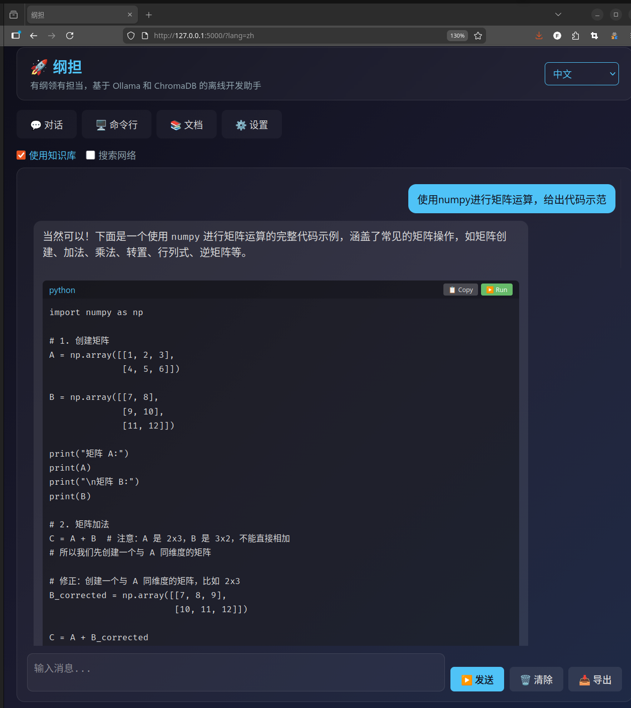
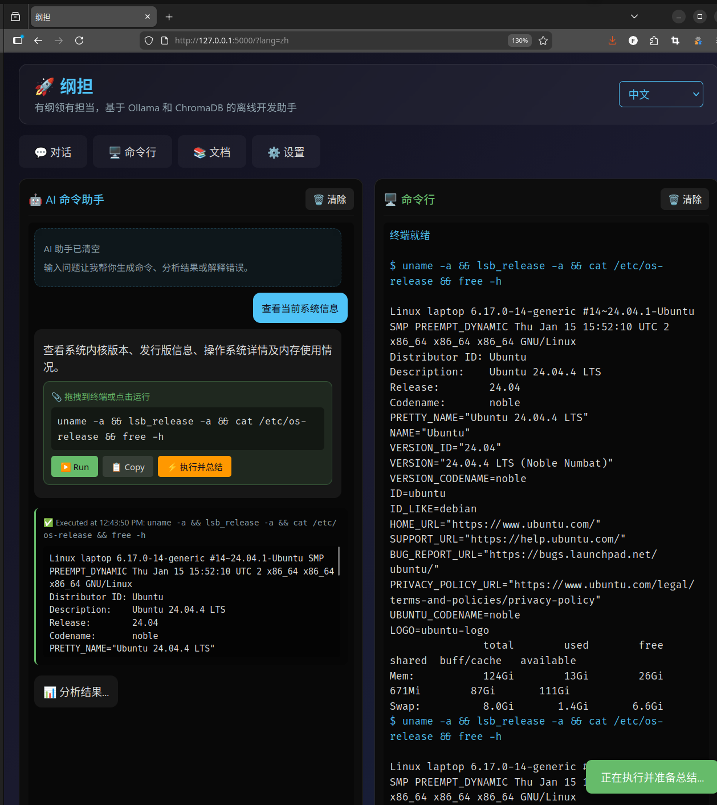
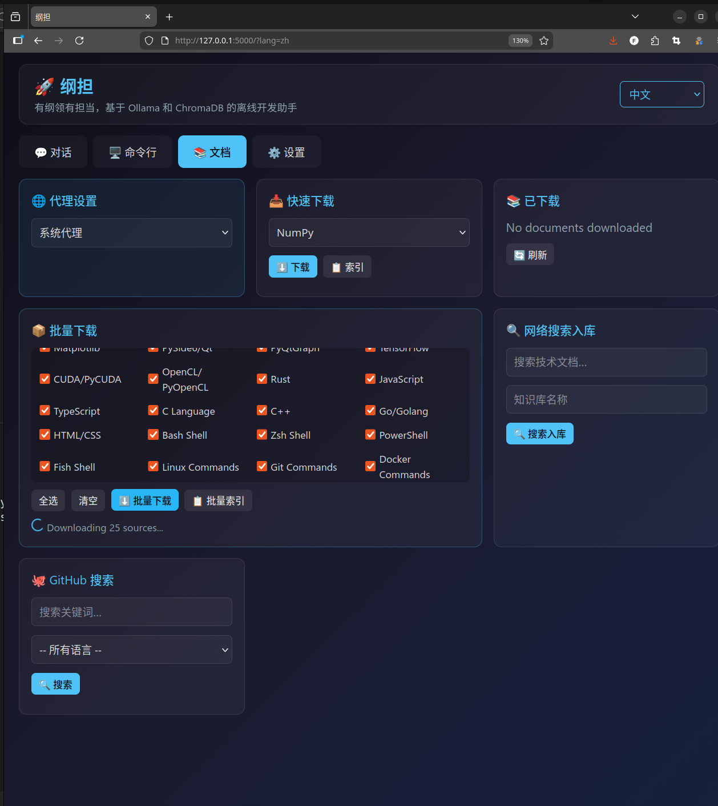
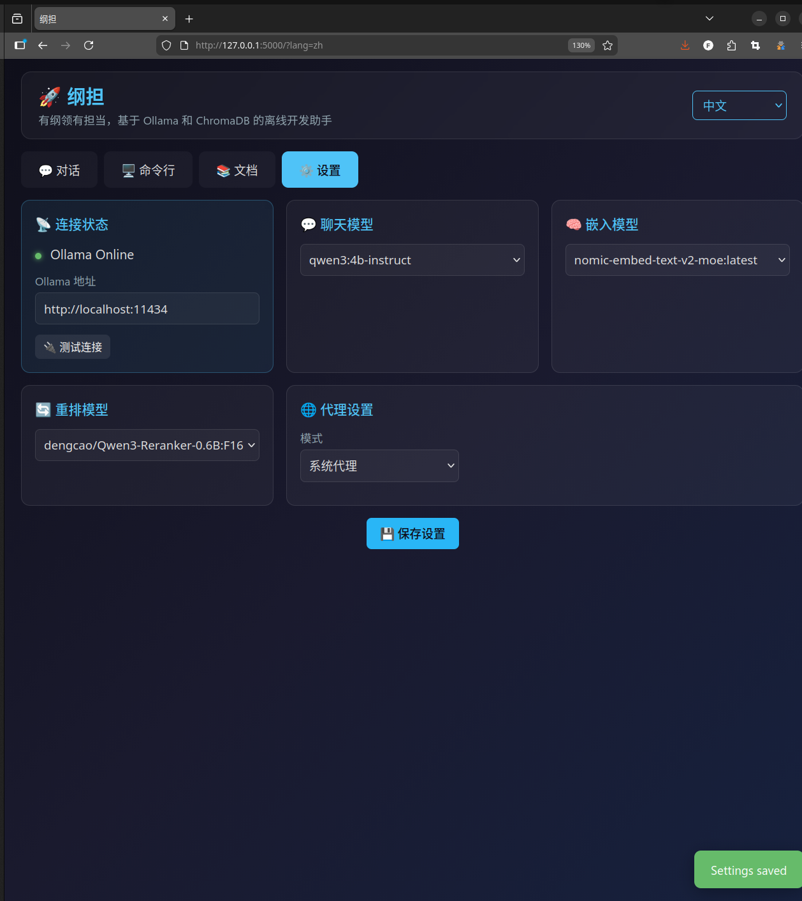
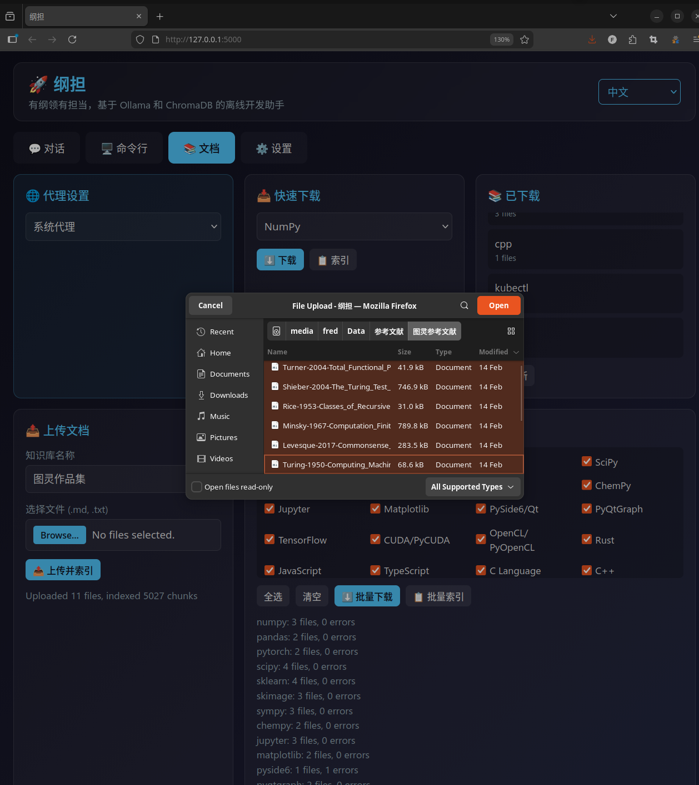
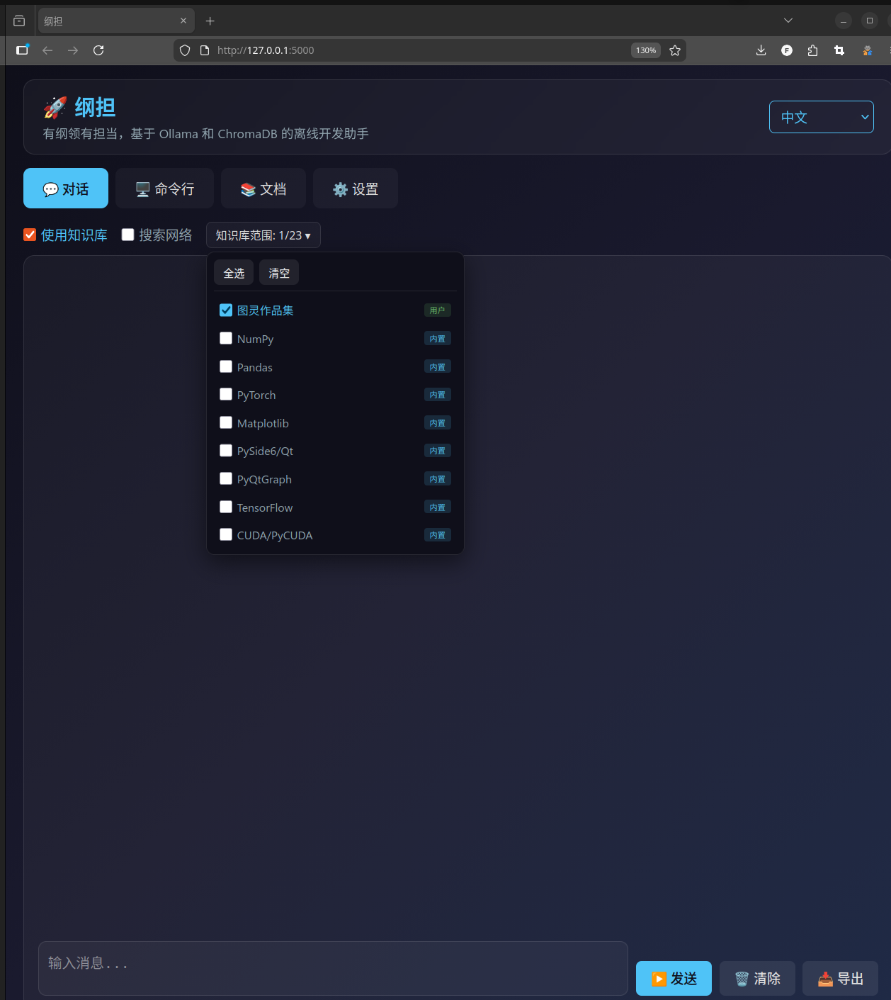
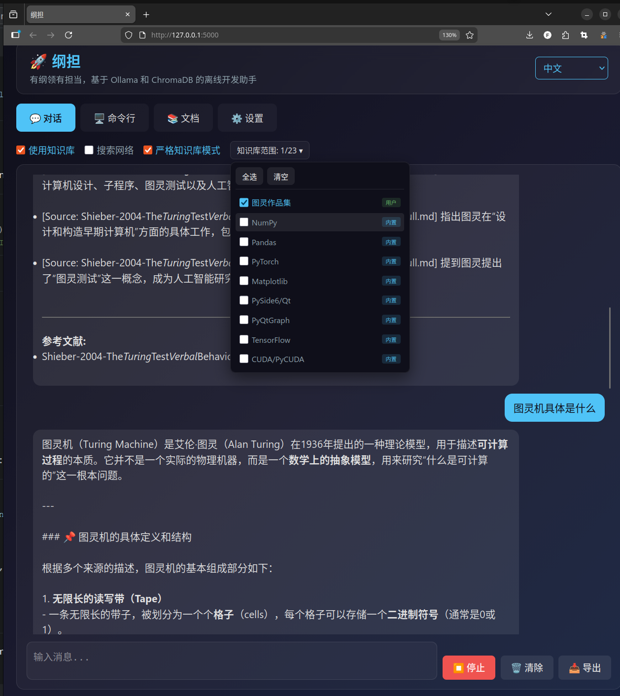

# 纲担 (GangDan) - 离线开发助手

基于 [Ollama](https://ollama.ai/) 和 [ChromaDB](https://www.trychroma.com/) 的本地离线编程助手。支持 LLM 对话、向量知识库检索、终端命令执行、AI 命令生成等功能，全部在浏览器中完成。

> **纲担** -- 有纲领有担当。



## 功能特性

- **RAG 智能对话** -- 支持从本地 ChromaDB 知识库和/或网络搜索（DuckDuckGo、SearXNG、Brave）中检索相关内容，通过 SSE 实时流式输出回复。支持**知识库范围选择**，可精确指定查询哪些知识库。
- **严格知识库模式** -- 开启后，若知识库中未检索到相关内容，系统将拒绝回答，确保回复仅基于可靠来源。
- **参考文献引用** -- 每次回答自动附带参考文献列表，标注内容来源的具体文档，方便追溯验证。
- **跨语言检索** -- 自动检测查询语言与文档语言，通过 Ollama 翻译实现跨语言 RAG 检索（如用中文查询英文文档）。
- **AI 命令助手** -- 用自然语言描述需求，AI 自动生成 Shell 命令，支持拖拽到终端、一键执行并自动总结结果。
- **内置终端** -- 在浏览器中直接执行命令，显示 stdout/stderr 输出。
- **文档管理器** -- 一键下载和索引 30+ 种热门库文档（Python、Rust、Go、JS、C/C++、CUDA、Docker、SciPy、Scikit-learn、SymPy、Jupyter 等）。支持批量操作和 GitHub 仓库搜索。
- **自定义知识库上传** -- 上传自己的 Markdown (.md) 和纯文本 (.txt) 文档，创建命名知识库。上传后自动索引，可立即用于 RAG 检索。支持重复文件检测，可选择跳过或覆盖。
- **10 种语言界面** -- 支持中文、英语、日语、法语、俄语、德语、意大利语、西班牙语、葡萄牙语、韩语，切换语言无需刷新页面。
- **代理支持** -- 提供无代理 / 系统代理 / 手动代理三种模式，适用于聊天后端和文档下载。
- **离线优先** -- 完全在本地运行，无需任何云端 API。

## 界面截图

| 聊天 | 终端 |
|:----:|:----:|
|  |  |

| 文档管理 | 设置 |
|:--------:|:----:|
|  |  |

| 上传文档 | 知识库范围选择 |
|:--------:|:-------------:|
|  |  |

| 严格知识库对话（含参考文献） |
|:---------------------------:|
|  |

上图展示了严格知识库模式下的对话效果：选择特定知识库后，系统仅从该知识库检索内容，并在回答末尾自动附加参考文献列表，标明内容出处。

## 环境要求

- Python 3.10+
- [Ollama](https://ollama.ai/) 本地运行（默认 `http://localhost:11434`）
- 已拉取聊天模型（如 `ollama pull qwen2.5`）
- 已拉取嵌入模型用于 RAG（如 `ollama pull nomic-embed-text`）

## 安装方式

### 方式一：通过 PyPI 安装（推荐）

```bash
pip install gangdan
```

安装完成后直接启动：

```bash
# 启动纲担
gangdan

# 或使用 python -m 方式
python -m gangdan

# 自定义主机和端口
gangdan --host 127.0.0.1 --port 8080

# 指定自定义数据目录
gangdan --data-dir /path/to/my/data
```

### 方式二：从源码安装（开发模式）

```bash
# 1. 克隆仓库
git clone https://github.com/cycleuser/GangDan.git
cd GangDan

# 2. （可选）创建并激活虚拟环境
python -m venv .venv
source .venv/bin/activate      # Linux/macOS
# .venv\Scripts\activate       # Windows

# 3. 以可编辑模式安装（含所有依赖）
pip install -e .

# 4. 启动纲担
gangdan
```

### Ollama 配置

启动纲担之前，请确保 Ollama 已安装并正在运行：

```bash
# 启动 Ollama 服务
ollama serve

# 拉取聊天模型
ollama pull qwen2.5

# 拉取 RAG 所需的嵌入模型
ollama pull nomic-embed-text
```

在浏览器中打开 [http://127.0.0.1:5000](http://127.0.0.1:5000) 即可使用。

## 命令行选项

```
gangdan [选项]

选项:
  --host TEXT       绑定的主机地址（默认: 0.0.0.0）
  --port INT        监听端口（默认: 5000）
  --debug           启用 Flask 调试模式
  --data-dir PATH   自定义数据目录
  --version         显示版本号并退出
```

## 项目结构

```
GangDan/
├── pyproject.toml              # 包元数据与构建配置
├── MANIFEST.in                 # 源码分发清单
├── LICENSE                     # GPL-3.0-or-later 许可证
├── README.md                   # 英文文档
├── README_CN.md                # 中文文档
├── gangdan/
│   ├── __init__.py             # 包版本号
│   ├── __main__.py             # python -m gangdan 入口
│   ├── cli.py                  # 命令行参数解析与启动
│   ├── app.py                  # Flask 后端（路由、Ollama、ChromaDB、国际化）
│   ├── templates/
│   │   └── index.html          # Jinja2 HTML 模板
│   └── static/
│       ├── css/
│       │   └── style.css       # 应用样式（暗色主题）
│       └── js/
│           ├── i18n.js         # 国际化与状态管理
│           ├── utils.js        # 面板切换与通知
│           ├── markdown.js     # Markdown / LaTeX (KaTeX) 渲染
│           ├── chat.js         # 聊天面板与 SSE 流式传输
│           ├── terminal.js     # 终端与 AI 命令助手
│           ├── docs.js         # 文档下载与索引
│           └── settings.js     # 设置面板与初始化
├── images/                     # 运行截图
├── publish.py                  # PyPI 发布辅助脚本
└── test_package.py             # 完整的包测试套件
```

运行时数据（自动创建）：

```
~/.gangdan/                     # pip 安装后的默认路径
  ├── gangdan_config.json       # 持久化配置
  ├── docs/                     # 下载的文档
  └── chroma/                   # ChromaDB 向量数据库
```

## 架构设计

前后端完全解耦：

- **后端**（`app.py`）-- 单个 Python 文件，包含 Flask 路由、Ollama 客户端、ChromaDB 管理器、文档下载器、网络搜索器和对话管理器。服务端配置通过 `window.SERVER_CONFIG` 注入模板。
- **前端**（`templates/` + `static/`）-- 纯 HTML/CSS/JS，无需构建步骤。JavaScript 文件按依赖顺序加载，通过全局函数共享状态。LaTeX 渲染使用 CDN 加载的 KaTeX。

ChromaDB 初始化具有自动故障恢复机制：如果数据库损坏，会自动备份并重新创建。

## 配置说明

所有设置均可通过界面中的**设置**标签页管理：

| 设置项 | 说明 |
|--------|------|
| Ollama 地址 | Ollama 服务地址（默认 `http://localhost:11434`） |
| 聊天模型 | 对话使用的模型（如 `qwen2.5:7b-instruct`） |
| 嵌入模型 | RAG 嵌入模型（如 `nomic-embed-text`） |
| 重排序模型 | 可选的重排序模型，提升搜索质量 |
| 代理模式 | `无代理` / `系统代理` / `手动代理` |

配置保存在数据目录下的 `gangdan_config.json` 文件中。

## 许可证

GPL-3.0-or-later，详见 [LICENSE](LICENSE)。
