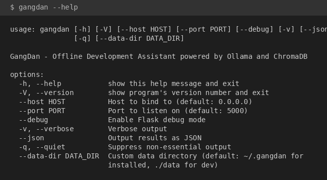

# 纲担 (GangDan) - 离线开发助手

基于 [Ollama](https://ollama.ai/) 和 [ChromaDB](https://www.trychroma.com/) 的本地离线编程助手。支持 LLM 对话、向量知识库检索、终端命令执行、AI 命令生成等功能，可在浏览器**或**命令行中完成。

> **纲担** -- 有纲领有担当。


## 功能特性

### GUI（Web 界面）

- **RAG 智能对话** -- 支持从本地 ChromaDB 知识库和/或网络搜索（DuckDuckGo、SearXNG、Brave）中检索相关内容，通过 SSE 实时流式输出回复。支持**知识库范围选择**，可精确指定查询哪些知识库。
- **严格知识库模式** -- 开启后，若知识库中未检索到相关内容，系统将拒绝回答，确保回复仅基于可靠来源。
- **参考文献引用** -- 每次回答自动附带参考文献列表，标注内容来源的具体文档，方便追溯验证。
- **跨语言检索** -- 自动检测查询语言与文档语言，通过 Ollama 翻译实现跨语言 RAG 检索（如用中文查询英文文档）。
- **AI 命令助手** -- 用自然语言描述需求，AI 自动生成 Shell 命令，支持拖拽到终端、一键执行并自动总结结果。
- **内置终端** -- 在浏览器中直接执行命令，显示 stdout/stderr 输出。
- **文档管理器** -- 一键下载和索引 30+ 种热门库文档（Python、Rust、Go、JS、C/C++、CUDA、Docker、SciPy、Scikit-learn、SymPy、Jupyter 等）。支持批量操作和 GitHub 仓库搜索。
- **自定义知识库上传** -- 上传自己的 Markdown (.md) 和纯文本 (.txt) 文档，创建命名知识库。上传后自动索引，可立即用于 RAG 检索。支持重复文件检测，可选择跳过或覆盖。
- **对话保存与加载** -- 将聊天对话保存为 JSON 文件，随时加载继续之前的对话。同时保留 Markdown 导出功能，方便分享。
- **10 种语言界面** -- 支持中文、英语、日语、法语、俄语、德语、意大利语、西班牙语、葡萄牙语、韩语，切换语言无需刷新页面。
- **代理支持** -- 提供无代理 / 系统代理 / 手动代理三种模式，适用于聊天后端和文档下载。
- **离线优先** -- 完全在本地运行，无需任何云端 API。

### CLI（命令行界面）

纲担还提供了功能完整的命令行界面，覆盖 GUI 的所有功能，专为终端工作流和自动化设计：

- **流式对话** -- `gangdan chat "你的问题"` 实时流式输出，支持知识库检索（`--kb`）和网络搜索（`--web`）。
- **交互式 REPL** -- `gangdan cli` 启动交互式会话，支持命令历史、自动建议和 Tab 补全。输入 `/help` 查看所有可用命令。
- **知识库操作** -- `gangdan kb list` 和 `gangdan kb search` 浏览和查询知识库。
- **文档管理** -- `gangdan docs list`、`gangdan docs download <源>`、`gangdan docs index <源>` 在终端中管理文档。
- **配置管理** -- `gangdan config get` 和 `gangdan config set <键> <值>` 查看和修改配置。
- **对话持久化** -- `gangdan conversation save/load/clear`，后台自动保存对话记录。
- **Shell 命令执行** -- `gangdan run <命令>` 内置危险命令安全检查。
- **AI 命令生成** -- `gangdan ai "描述你想做的事"` 从自然语言描述生成 Shell 命令。
- **精美终端输出** -- 通过 `rich` 库实现格式化表格、语法高亮代码块和 Markdown 渲染。

## 界面截图

| 聊天 | 终端 |
|:----:|:----:|
|  |  |

| 文档管理 | 设置 |
|:--------:|:----:|
|  |  |

| 上传文档 | 知识库范围选择 |
|:--------:|:-------------:|
|  |  |

| 严格知识库对话（含参考文献） |
|:---------------------------:|
|  |

上图展示了严格知识库模式下的对话效果：选择特定知识库后，系统仅从该知识库检索内容，并在回答末尾自动附加参考文献列表，标明内容出处。

| 加载对话 | 对话已加载 |
|:--------:|:---------:|
|  |  |

将聊天记录保存为 JSON 文件，随时加载以继续之前的对话。文件选择器接受 GangDan 导出的 `.json` 文件，完整恢复消息历史和上下文。

## 环境要求

- Python 3.10+
- [Ollama](https://ollama.ai/) 本地运行（默认 `http://localhost:11434`）
- 已拉取聊天模型（如 `ollama pull qwen2.5`）
- 已拉取嵌入模型用于 RAG（如 `ollama pull nomic-embed-text`）

## 安装方式

### 方式一：通过 PyPI 安装（推荐）

```bash
pip install gangdan
```

安装完成后直接启动：

```bash
# 启动纲担 Web 界面
gangdan

# 启动 CLI 交互模式
gangdan cli

# 或使用 python -m 方式
python -m gangdan

# 自定义主机和端口
gangdan --host 127.0.0.1 --port 8080

# 指定自定义数据目录
gangdan --data-dir /path/to/my/data
```

### 方式二：从源码安装（开发模式）

```bash
# 1. 克隆仓库
git clone https://github.com/cycleuser/GangDan.git
cd GangDan

# 2. （可选）创建并激活虚拟环境
python -m venv .venv
source .venv/bin/activate      # Linux/macOS
# .venv\Scripts\activate       # Windows

# 3. 以可编辑模式安装（含所有依赖）
pip install -e .

# 4. 启动纲担（Web 或 CLI）
gangdan            # Web GUI
gangdan cli        # 交互式 CLI
```

### Ollama 配置

启动纲担之前，请确保 Ollama 已安装并正在运行：

```bash
# 启动 Ollama 服务
ollama serve

# 拉取聊天模型
ollama pull qwen2.5

# 拉取 RAG 所需的嵌入模型
ollama pull nomic-embed-text
```

在浏览器中打开 [http://127.0.0.1:5000](http://127.0.0.1:5000) 即可使用。

## 命令行选项

### Web 服务器模式（默认）

```
gangdan [选项]

选项:
  --host TEXT       绑定的主机地址（默认: 0.0.0.0）
  --port INT        监听端口（默认: 5000）
  --debug           启用 Flask 调试模式
  --data-dir PATH   自定义数据目录
  --version         显示版本号并退出
```

### CLI 模式

```bash
# 交互式 REPL（推荐终端用户使用）
gangdan cli

# 流式对话
gangdan chat "如何使用 Python 装饰器？"
gangdan chat "解释 numpy 广播机制" --kb numpy
gangdan chat "最新的 Python 新闻" --web

# 知识库操作
gangdan kb list
gangdan kb search "排序算法"

# 文档管理
gangdan docs list
gangdan docs download numpy pandas pytorch
gangdan docs index numpy

# 配置管理
gangdan config get
gangdan config get language
gangdan config set language zh
gangdan config set chat_model qwen2.5:14b

# 对话管理
gangdan conversation save my_session.json
gangdan conversation load my_session.json
gangdan conversation clear

# 执行 Shell 命令（带安全检查）
gangdan run ls -la
gangdan run python --version

# AI 命令生成
gangdan ai "查找所有大于 1MB 的 Python 文件"
gangdan ai "将当前目录压缩为 tar.gz"
```

### REPL 命令

在 `gangdan cli` 中，可使用以下命令：

| 命令 | 说明 |
|------|------|
| `你好...` | 普通聊天消息（直接输入按回车） |
| `/kb list` | 列出所有知识库 |
| `/kb search <查询>` | 搜索知识库 |
| `/docs list` | 列出已下载的文档 |
| `/docs download <源>` | 下载文档源 |
| `/config` | 显示当前配置 |
| `/config set <键> <值>` | 更新配置值 |
| `/save [文件]` | 保存对话为 JSON |
| `/load <文件>` | 从 JSON 加载对话 |
| `/clear` | 清除对话历史 |
| `/run <命令>` | 执行 Shell 命令 |
| `/ai <描述>` | 从描述生成命令 |
| `/help` | 显示帮助信息 |
| `exit` / `quit` / `q` | 退出 REPL |

## 项目结构

```
GangDan/
├── pyproject.toml              # 包元数据与构建配置
├── MANIFEST.in                 # 源码分发清单
├── LICENSE                     # GPL-3.0-or-later 许可证
├── README.md                   # 英文文档
├── README_CN.md                # 中文文档
├── gangdan/
│   ├── __init__.py             # 包版本号
│   ├── __main__.py             # python -m gangdan 入口
│   ├── cli.py                  # 入口路由（Web vs CLI）
│   ├── cli_app.py              # CLI 应用（命令 + REPL）
│   ├── app.py                  # Flask 后端（路由、国际化、GUI 逻辑）
│   ├── core/                   # 共享核心模块
│   │   ├── __init__.py         # 核心模块导出
│   │   ├── config.py           # 配置数据类、国际化、语言检测
│   │   ├── ollama_client.py    # Ollama API 客户端（对话、嵌入、流式）
│   │   ├── chroma_manager.py   # ChromaDB 管理器（自动恢复）
│   │   ├── conversation.py     # 对话管理器（自动保存）
│   │   ├── doc_manager.py      # 文档下载器与索引器
│   │   └── web_searcher.py     # DuckDuckGo 网络搜索
│   ├── templates/
│   │   └── index.html          # Jinja2 HTML 模板
│   └── static/
│       ├── css/
│       │   └── style.css       # 应用样式（暗色主题）
│       └── js/
│           ├── i18n.js         # 国际化与状态管理
│           ├── utils.js        # 面板切换与通知
│           ├── markdown.js     # Markdown / LaTeX (KaTeX) 渲染
│           ├── chat.js         # 聊天面板与 SSE 流式传输
│           ├── terminal.js     # 终端与 AI 命令助手
│           ├── docs.js         # 文档下载与索引
│           └── settings.js     # 设置面板与初始化
├── tests/                      # 完整测试套件
│   ├── conftest.py             # 共享测试夹具与配置
│   ├── test_core_config.py     # 配置、国际化、语言检测测试
│   ├── test_core_ollama_client.py  # Ollama 客户端测试
│   ├── test_core_chroma_manager.py # ChromaDB 管理器测试
│   ├── test_core_conversation.py   # 对话与自动保存测试
│   ├── test_core_doc_manager.py    # 文档管理器测试
│   ├── test_core_web_searcher.py   # 网络搜索测试
│   ├── test_cli_commands.py    # CLI 命令集成测试
│   └── test_cli_repl.py        # REPL 与向后兼容性测试
├── images/                     # 运行截图
├── publish.py                  # PyPI 发布辅助脚本
└── test_package.py             # 包安装测试
```

运行时数据（自动创建）：

```
~/.gangdan/                     # pip 安装后的默认路径
  ├── gangdan_config.json       # 持久化配置
  ├── cli_conversation.json     # CLI 自动保存的对话历史
  ├── cli_history               # CLI REPL 命令历史
  ├── user_kbs.json             # 用户知识库清单
  ├── docs/                     # 下载的文档
  └── chroma/                   # ChromaDB 向量数据库
```

## 架构设计

纲担采用模块化架构，Web GUI 和 CLI 共享核心模块：

```
                    ┌──────────────┐    ┌──────────────┐
                    │  Flask GUI   │    │  CLI / REPL  │
                    │  (app.py)    │    │ (cli_app.py) │
                    └──────┬───────┘    └──────┬───────┘
                           │                   │
                    ┌──────┴───────────────────┴──────┐
                    │          gangdan/core/           │
                    ├─────────────────────────────────┤
                    │ config.py      │ ollama_client.py│
                    │ chroma_manager │ conversation.py │
                    │ doc_manager.py │ web_searcher.py │
                    └─────────────────────────────────┘
                           │                   │
                    ┌──────┴───────┐    ┌──────┴───────┐
                    │    Ollama    │    │   ChromaDB   │
                    └──────────────┘    └──────────────┘
```

- **核心模块**（`gangdan/core/`）-- 提取为可复用的共享业务逻辑：配置管理、Ollama API 客户端、ChromaDB 向量存储管理、对话持久化、文档下载/索引、网络搜索。
- **GUI 后端**（`app.py`）-- Flask 路由和 SSE 流式传输。服务 Web 前端并委托给核心模块处理。
- **CLI 应用**（`cli_app.py`）-- 完整的命令行界面，支持子命令和交互式 REPL。使用 `rich` 库实现终端格式化，`prompt_toolkit` 实现带历史和补全的交互输入。
- **前端**（`templates/` + `static/`）-- 纯 HTML/CSS/JS，无需构建步骤。JavaScript 文件按依赖顺序加载，通过全局函数共享状态。LaTeX 渲染使用 CDN 加载的 KaTeX。

ChromaDB 初始化具有自动故障恢复机制：如果数据库损坏，会自动备份并重新创建。

## 配置说明

所有设置均可通过界面中的**设置**标签页管理：

| 设置项 | 说明 |
|--------|------|
| Ollama 地址 | Ollama 服务地址（默认 `http://localhost:11434`） |
| 聊天模型 | 对话使用的模型（如 `qwen2.5:7b-instruct`） |
| 嵌入模型 | RAG 嵌入模型（如 `nomic-embed-text`） |
| 重排序模型 | 可选的重排序模型，提升搜索质量 |
| 代理模式 | `无代理` / `系统代理` / `手动代理` |

配置保存在数据目录下的 `gangdan_config.json` 文件中。

## 测试

纲担包含完整的测试套件，共 142 个测试，覆盖所有核心模块和 CLI 功能：

```bash
# 运行全部测试
python -m pytest tests/ -v

# 运行特定测试模块
python -m pytest tests/test_core_config.py -v
python -m pytest tests/test_cli_commands.py -v

# 带覆盖率报告运行
python -m pytest tests/ --cov=gangdan --cov-report=term-missing
```

测试覆盖范围：

| 模块 | 测试数 | 覆盖内容 |
|------|--------|----------|
| `core/config.py` | 19 | 配置持久化、国际化、语言检测、KB 名称清理、代理 |
| `core/ollama_client.py` | 14 | 客户端初始化、可用性、模型分类、嵌入、流式对话 |
| `core/chroma_manager.py` | 8 | 集合增删改查、文档添加/搜索、空客户端安全、恢复 |
| `core/conversation.py` | 12 | 消息管理、持久化、自动保存线程、优雅关闭 |
| `core/doc_manager.py` | 11 | 源验证、下载/索引、文本分块 |
| `core/web_searcher.py` | 6 | 搜索、错误处理、超时、代理集成 |
| `cli_app.py`（命令） | 31 | 所有子命令：config、conversation、chat、run、ai、docs、kb |
| `cli_app.py`（REPL） | 17 | 命令解析、懒加载、向后兼容、入口路由 |
| **合计** | **142** | |

所有测试均离线运行，使用 Mock 模拟外部服务（Ollama API、ChromaDB、HTTP）。无需运行 Ollama 实例或网络连接。

## 开发

```bash
# 安装开发依赖
pip install -e ".[dev]"
pip install pytest pytest-mock pytest-cov

# 运行测试
python -m pytest tests/ -v

# 快速语法检查
python -c "import gangdan.cli_app; import gangdan.core"
```

## Python API

```python
from gangdan import chat, index_documents

# 与助手对话
result = chat("解释 Python 装饰器", model="qwen2.5:7b-instruct")
print(result.data)  # 助手回复

# 索引文档到知识库
result = index_documents("./docs", collection="my-project")
print(result.data)  # {"indexed": 42}
```

## Agent 集成（OpenAI Function Calling）

GangDan 提供 OpenAI 兼容的工具定义，可供 LLM Agent 调用：

```python
from gangdan.tools import TOOLS, dispatch

response = client.chat.completions.create(
    model="gpt-4o",
    messages=messages,
    tools=TOOLS,
)

result = dispatch(
    tool_call.function.name,
    tool_call.function.arguments,
)
```

## CLI 帮助



## 许可证

GPL-3.0-or-later，详见 [LICENSE](LICENSE)。
